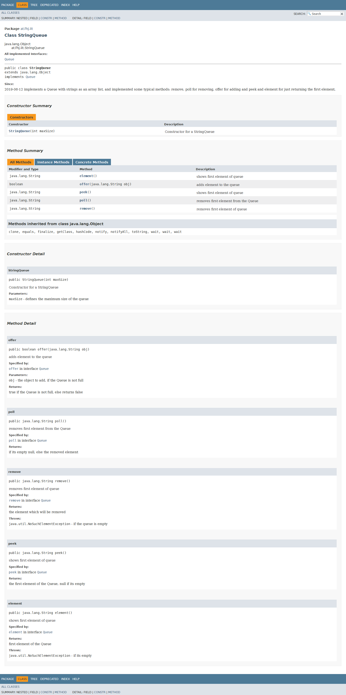
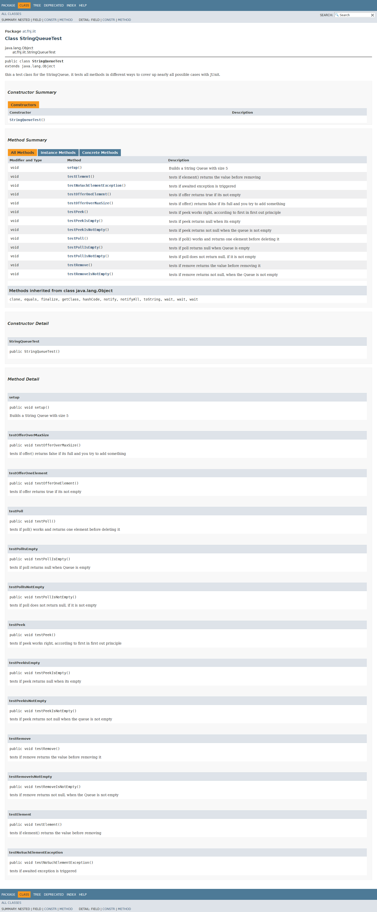
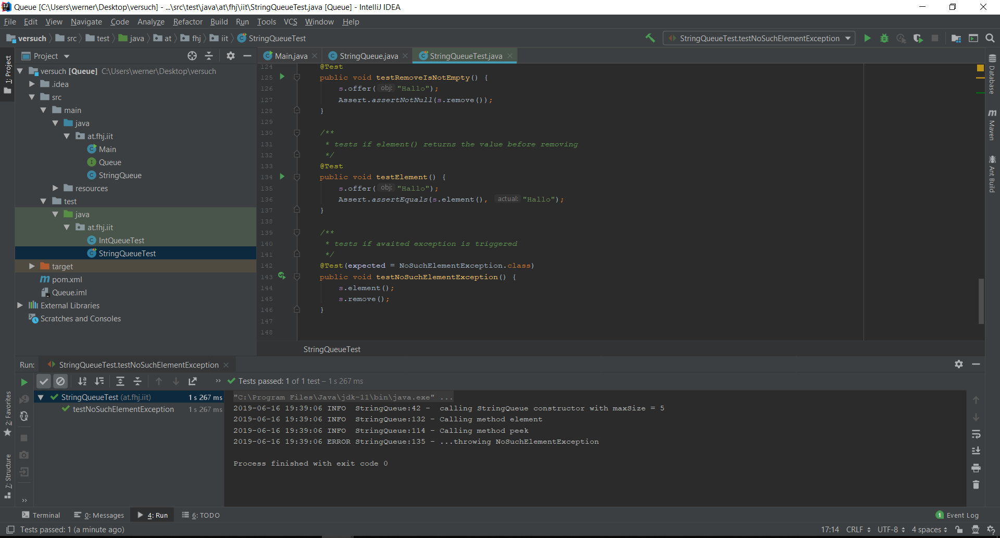
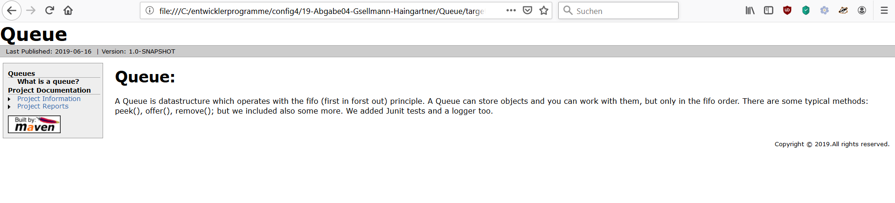
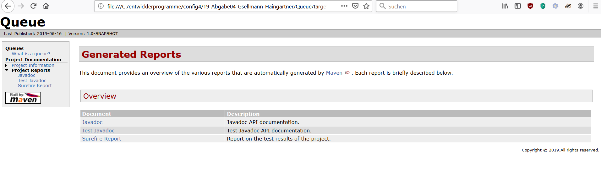

# Lab Report vertiefende Gesamtwiederholung #

Abgabe 04

Gerald Gsellmann

Werner Haingartner

Repository: https://github.com/Woean/19-Abgabe04-Gsellmann-Haingartner

Dieses Readme dient als Protokoll für die abschließende Übung. 

## Task List ##

- [x] Übertragen Angabe Taskliste in Markdown Readme

- [x] Einspielen Queue Vorlage aus Repository: https://github.com/michaelulm/softwareconfiguration-
management/tree/master/test-automation/Queue

- [x] Taskergebnisse Schritt für Schritt auf Git stellen

  - [x] Führung Taskliste

  - [x] Veröffentlichung in Git mit aktuell durchgeführten Tätigkeiten, z.B. Testfälle geschrieben so wird auch in der Taskliste diese Aufgabe als erledigt markiert und Testfälle inkl. geänderter Taskliste ins Repository übertragen.

- [x] Korrigieren Sie den Code bzw. Debuggen Sie ihn um die Fehler zu finden

  - [x] Es befinden sich gesamt 3 Fehler im Source Code.

  - [x] Bei Bedarf Optimieren Sie das Queue Beispiel.

  - [x] Ergänzen Sie das Beispiel nach eigenen Ermessen um es testen zu können.

- [x] Erstellen Sie für Klasse und alle Methoden Kommentare um mittels Javadoc eine API Dokumentation zu erzeugen

  - [x] Integrieren Sie ein Bild (der generierten Dokumentation) in Ihren Report.

- [x] Erstellung JUnit Tests (vollständig testen, mehrere Varianten)

  - [x] Sie werden die „selben“ Testfälle mehrfach erstellen müssen um „mehrere Variationen“ für einen möglichst vollständigen Test zu erreichen. Achten Sie dabei mit unterschiedlichen Daten zu testen.

  - [x] JavaDoc Kommentare erstellen.

  - [x] Integrieren Sie ein Bild (der generierten Dokumentation) in Ihren Report.

- [x] Passen Sie Ihr pom.xml auf das Projekt an, damit Sie das Projekt erstellen aber auch Dokumentation generieren können.

  - [x] EntwicklerInnen Informationen hinzufügen.

  - [x] Integration Logging Bibliothek log4j mittels Maven Dependencies.

- [x] Log4j (Version 2) integrieren und in jeder Methode ins Log schreiben

  - [x] Siehe aktualisiertes Stack Beispiel.

  - [x] Erstellen Sie einen Statischen Logger der auf die Konsole schreibt.

  - [x] Konfigurieren Sie Logger über ein properties File.

  - [x] Geben Sie eine Info Lognachricht bei Aufruf einer jeden Methode aus.

  - [x] Geben Sie eine Error Lognachricht aus bevor Sie einen Fehler werfen.

  - [x] Ergebnisse (Konsolenausgabe) als Bild in Dokumentation einfließen lassen.

- [x] Maven Site Dokumentation erstellen

  - [x] Inklusive Javadoc Code und Javadoc Test Klassen

  - [x] Inklusive Menü mit Verweis auf manuell erstellte Seite

    - [x] Seite erläutert Funktionsweise Queue

  - [x] Geben Sie ein Bild der Maven Site Dokumentation in den Lab Report

    - [x] Der Inhalt der manuell erstellten Seite sollte ersichtlich sein

- [x] Erstellung detaillierter und nachvollziehbarer Markdown Lab Report

  - [x] Übertragung Information aus Labreport Template.

  - [x] Alle Schritte dieser Übung nachvollziehbar erläutern.

  - [x] Übung Github Flavor: Erstellen Sie einen Codeblock im Dokument, welcher 3   Zeilen Python und 3 Zeilen Java Source Code korrekt darstellt.

  - [x] Korrekturlesen Dokumentation

  - [x] PDF erstellen (zB Dillinger)

- [x] Überprüfung Vollständigkeit der Abgabe

- [x] Abgabe PDF Version der Abgabe

***Vorgehen:***

- zuerst wurden alle benötigten Dokumente von Moodle gedownloaded
- danach wurden die Arbeitsaufträge durchgesehen und das benötigte Repository erstellt
- anschließend wurde die Tasklist erstellt und Markdwon gelernt

****Code korrigieren****

- beim ersten "richtigen" Arbeitsauftrag, mussten wir eine bereits mittels Interface implementierte Queue durchsehen und Fehler finden. Um dies zu bewerkstelligen, haben wir zuerst die Methoden mittels der Kommentare im Interface zu verstehen versucht und gestet. Somit wurden insgesamt die 3 mutwillig in den Code platzierten Fehler gefunden und korrigiert. 

- im Constructor ein typo (falsch geschriebener Übergabeparameter)
- in der poll Methode ein Implementierungsfehler
- in der remove Methode ebenfalls ein Implentierungsfehler

****Javadoc****

Es wurden für die Klasse StringQueue, für den darin enthaltenen Konstruktor und den darin enthaltenen Methoden Javadoc Kommentare erstellt. Es wurde mit IntelliJ gearbeitet; wenn oberhalb einer Methode ein Javadoc Kommentar mittels
/**
*
*
/
erzeugt wird, werden die übergebenen zu beschreibenden Parameter @param schon vorgeschlagen. Nun wird für jedes Kommentar eine Kurzbeschreibung verfasst, die Parameter, return Werte oder exceptions die gethrowed werden, werden ebenfalls beschrieben. In IntelliJ kann man einfach durch klicken auf -> tools -> generate eine Api Dokumentation in HTML automatisch erzeugen. Siehe Bid: 



****JUnit Tests****

Es wurden mit Hilfe von JUnit testcases implementiert, die die Funktionalität der StringQueue durchtesten und somit gewährleisten sollten. Es wurde wieder mit IntelliJ gearbeitet, weil sich diese IDE gut für JUnit eignet. Zudem wurden für alle Testcases wie im nachfolgenden Bild sichtbar Javadoc Kommentare erstellt: 



****pom.xml****

Um das Projekt automatisch mit Hilfe von Maven builden zu können, haben wir dem pom.xml File unsere Entwicklerinfos hinzugefügt. Zudem haben wir die Logging Bibliothek log4j als dependency hinzugefügt.

****Log4j****

Dadurch, dass wir vorhin schon eine Logging Bibliothek mit Maven unserem Projekt hinzugefügt haben, konnten wir nun einen statischen Logger erstellen, der jedes Mal beim Aufrufen einer Methode eine Info Nachricht auf die Konsole schreibt und beim Werfen einer Exception eine Error Nachricht auf die Konsole schreibt. Zusätzlich mussten wir noch eine .propertis Datei von einer früheren Übung hinzufügen. 



****Maven Site****

Zuerst wurden die notwendigen plugins dem pom.xml hinzugefügt, um mit mvn site eine Dokumentation, die auch Javadoc und die dazugehörigen Tests beinhaltet, zu generieren. Es wurde auch noch mit site.xml ein eigener Menüpunkt erstellt, der auf eine eigene in Markdwon geschriebene Seite verweist, wo die Funktion einer Queue erläutert wird. 






****Übung Github Flavour****

Um den Umgang mit Github Flavour (ein Dialekt einer markdown Sparche) zu erlernen, sollen wir jeweils ein paar Zeilen Python und Java Code schreiben und richtig formatiert ausgeben, was folgendermaßsen aussieht: 

Python: 

 ```python
 def fakultaet(x):
 return x * fakultaet(x - 1) if x > 1 else 1
 ```
 
 Java: 
 
 ```java
 public class HalloWelt {
 public static void main(String[] args) {
 System.out.println("Hallo Welt!");
 }
 }
 ```
 
 **Links/Literatur**
 
 - erklärt maven site
 https://maven.apache.org/doxia/references/index.html
 - hilft bei GitHub Flavor
 https://github.github.com/gfm/
 - erklärt logging
 http://openbook.rheinwerk-verlag.de/java7/1507_20_001.html
 
 
